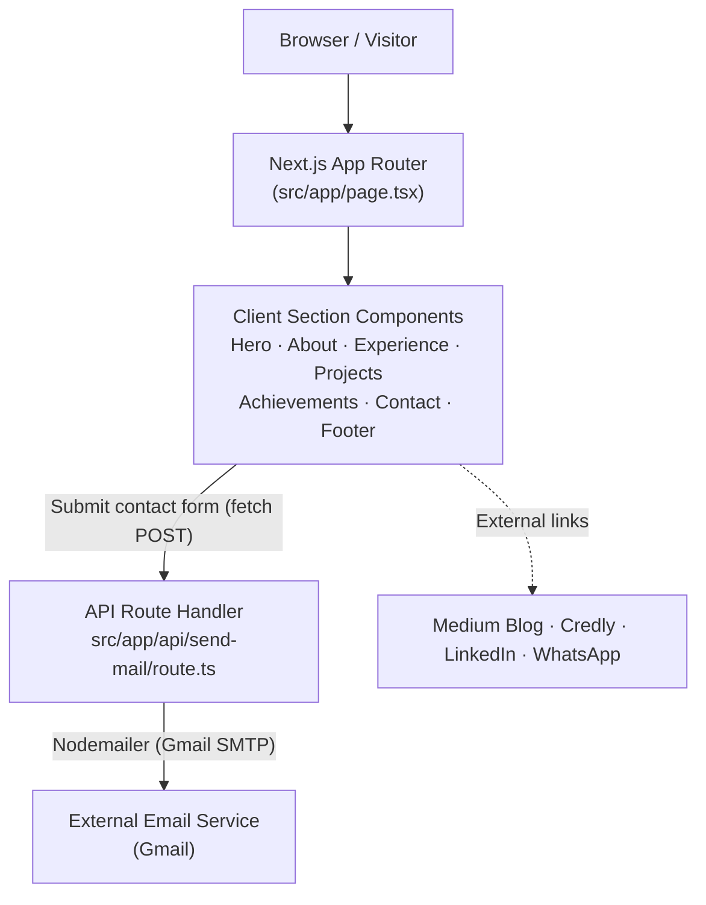
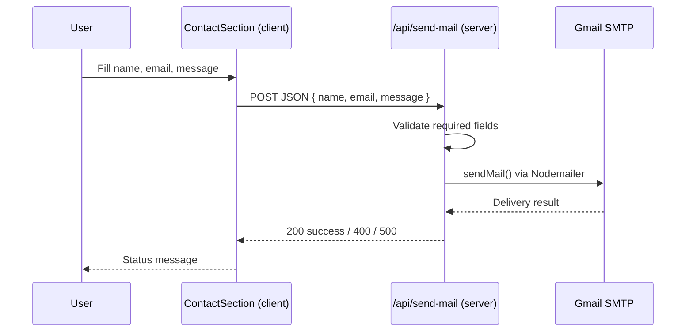

# RS Portfolio — Ravi Sharma

A modern, animated **single-page developer portfolio** built with **Next.js 14 (App Router)** and **TypeScript**. It showcases an about section, professional experience timeline, projects, achievements/certifications, and a working contact form that delivers messages over email.

<p align="left">
  
  
  
  
  
  
</p>

> **Note on scope:** This is a front-end presentational site with a single serverless email API route. It intentionally has **no database, authentication, or AI features** — the README stays truthful to what the codebase actually contains.

---

## Screenshots

> Placeholders — replace the paths below with real captures of the running site.

| View | Preview |
| --- | --- |
| Hero / Landing | `` _(placeholder — image not yet added)_ |
| Experience Timeline | `` _(placeholder)_ |
| Projects | `` _(placeholder)_ |
| Contact Form | `` _(placeholder)_ |

---

## Live Demo

> **No live deployment URL is committed in the repository.**

The site is deployed on **Netlify** via Netlify's Git integration (configured in the Netlify dashboard, not in the repo — there is no `netlify.toml` or deploy metadata committed).

- **Live Site:** _TBD — add your Netlify production URL here_
- **Blog (external, linked from the navbar):** https://javascriptcentric.medium.com/

---

## Features

Only features that are actually implemented in the source are listed.

### Responsive UI
- Single-page layout with fixed navbar and smooth in-page anchor navigation (`#about`, `#experience`, `#projects`, `#achievements`, `#contact`).
- Fully responsive design (mobile hamburger menu + desktop nav) using Tailwind breakpoints.
- Animated intro loader (SVG "RS" logo drawn with Framer Motion) shown for ~3 seconds on load.
- Active-section highlighting driven by a custom `IntersectionObserver` hook (`useActiveSection`).

### Content Sections
- **Hero** — intro with a character-by-character typing animation.
- **About** — bio plus a grid of currently-used technologies.
- **Experience** — vertical animated timeline of professional roles.
- **Projects** — interactive 3D tilt cards.
- **Achievements** — certification/award cards linking to Credly / LinkedIn credentials.
- **Contact** — validated form plus quick social buttons (Email, LinkedIn, WhatsApp).

### Contact / Email
- Contact form posts to an internal API route (`/api/send-mail`).
- Server-side field validation and email delivery via **Nodemailer** (Gmail transport).
- Client-side status feedback ("Sending…", success, error) with auto-reset.

### Motion & Visual Effects
- Framer Motion transitions across navbar, logo, timeline, and section reveals.
- Reusable UI kit: 3D cards, animated testimonials, magic card, text reveal, timeline, typing animation.
- Custom `threeD` button variant and shadcn/ui-style primitives.

### Developer Experience
- Strict TypeScript, path alias `@/*`.
- ESLint (React, React Hooks, TypeScript, Tailwind, Prettier plugins) + Prettier.
- Husky git hooks: `pre-commit` (lint-staged) and `commit-msg` (commitlint / Conventional Commits).

---

## Tech Stack

| Layer | Technology |
| --- | --- |
| **Languages** | TypeScript, TSX/JSX, CSS |
| **Frontend** | Next.js 14 (App Router), React 18 |
| **Backend** | Next.js Route Handlers (serverless API) |
| **Styling** | Tailwind CSS 3.4, `tailwindcss-animate`, `tailwind-merge`, `clsx`, `class-variance-authority` |
| **UI Components** | shadcn/ui setup (`components.json`), Radix UI primitives, Aceternity-style custom components |
| **Animation** | Framer Motion 11 |
| **Icons** | `lucide-react`, `react-icons`, `@tabler/icons-react`, `@radix-ui/react-icons` |
| **Email** | Nodemailer (Gmail SMTP) |
| **Theming** | `next-themes` (installed; Tailwind `darkMode: 'class'` configured) |
| **Scrolling** | `react-scroll` |
| **Database** | _None_ |
| **Authentication** | _None_ |
| **AI** | _None_ |
| **Cloud** | _None configured in repo_ |
| **Deployment** | Netlify (configured via dashboard Git integration; no deploy config committed) |
| **DevOps / Tooling** | ESLint, Prettier, Husky, lint-staged, commitlint, Commitizen |
| **Testing** | _None_ |
| **Package Manager** | npm (only `package-lock.json` is committed) |

---

## Architecture Overview

This is a **client-rendered single page** (`page.tsx` is a `'use client'` component composing all sections) plus **one server-side API route** for email. There is no database or external data store.



**Request flow for the contact form:**



---

## Folder Structure

```
myportfolio/
├── public/
│   └── images/                 # Profile photo, certification badges, award images
├── src/
│   ├── app/
│   │   ├── api/
│   │   │   └── send-mail/
│   │   │       └── route.ts    # POST handler — contact form email via Nodemailer
│   │   ├── fonts/              # Local Geist font files (woff)
│   │   ├── favicon.ico
│   │   ├── globals.css         # Tailwind layers + CSS design tokens (light/dark)
│   │   ├── layout.tsx          # Root layout & metadata
│   │   └── page.tsx            # Home page — composes all sections + loader
│   ├── components/
│   │   ├── about/              # About section
│   │   ├── achievements/       # Certifications & awards cards
│   │   ├── contact/            # Contact form + social links
│   │   ├── experience/         # Work-history timeline data + view
│   │   ├── hero/               # Landing hero with typing animation
│   │   ├── navbar/             # Fixed responsive navigation
│   │   ├── projects/           # 3D project cards
│   │   └── ui/                 # Reusable UI kit (button, card, timeline, etc.)
│   ├── hooks/
│   │   └── useActiveSection.tsx # IntersectionObserver-based active-section tracker
│   └── lib/
│       └── utils.ts            # cn() Tailwind class-merge helper
├── .husky/                     # Git hooks (pre-commit, commit-msg, install)
├── components.json             # shadcn/ui configuration
├── next.config.mjs             # Next.js config (image domains, eslint ignore)
├── tailwind.config.ts          # Tailwind theme & tokens
├── tsconfig.json               # TypeScript config + @/* path alias
└── package.json
```

**Major folder purposes**

| Folder | Purpose |
| --- | --- |
| `src/app` | App Router entry: layout, home page, global styles, and the email API route. |
| `src/components/*` | One folder per page section, each a self-contained React component. |
| `src/components/ui` | Shared, presentation-only building blocks (buttons, cards, timeline, animations). |
| `src/hooks` | Custom React hooks (currently active-section detection). |
| `src/lib` | Small utilities (`cn` class merging). |
| `public/images` | Static assets served at `/images/...`. |
| `.husky` | Git hook scripts enforcing lint + commit conventions. |

---

## Installation

### Prerequisites
- **Node.js** 18.17+ (required by Next.js 14)
- **npm** (repository ships `package-lock.json`)
- A **Gmail account with an App Password** if you want the contact form to send email

### Clone
```bash
git clone https://github.com/ravics09/myportfolio.git
cd myportfolio
```

### Install
```bash
npm install
```

### Environment Variables
Create a `.env.local` file in the project root (no `.env.example` is provided in the repo):

```bash
EMAIL_USER=your-gmail-address@gmail.com
EMAIL_PASS=your-gmail-app-password
```

### Development
```bash
npm run dev
# App runs at http://localhost:3000
```

### Production
```bash
npm run build
npm run start
```

### Docker
> **No Dockerfile or docker-compose configuration exists in this repository.** To containerize it you would need to add your own (e.g. a multi-stage Node/Next.js image). This is noted as a recommendation, not an existing feature.

---

## Environment Variables

Only the following variables are referenced in the codebase (`src/app/api/send-mail/route.ts`):

| Variable | Required | Used By | Description |
| --- | --- | --- | --- |
| `EMAIL_USER` | Yes (for email) | `/api/send-mail` | Gmail address used as the Nodemailer auth user and the destination inbox for contact messages. |
| `EMAIL_PASS` | Yes (for email) | `/api/send-mail` | Gmail App Password used as the Nodemailer auth credential. |

> If these are not set, the site still renders fully; only the contact-form email delivery will fail (returns HTTP 500).

---

## Available Scripts

Defined in `package.json`:

| Script | Command | Description |
| --- | --- | --- |
| `dev` | `next dev` | Start the local development server with hot reload. |
| `build` | `next build` | Create an optimized production build. |
| `start` | `next start` | Serve the production build. |
| `lint` | `next lint` | Run ESLint across the project. |
| `format` | `npx prettier --write .` | Format all files with Prettier. |
| `format-write` | `npx prettier --write --all=true` | Force-format all files. |
| `format-check` | `npx prettier --check --all=true` | Verify formatting without writing changes. |
| `prepare` | `husky` | Install Husky git hooks (runs automatically after `npm install`). |

---

## Project Workflow

- **Development** — `npm run dev`; edit any section under `src/components/*` and the page hot-reloads.
- **Build** — `npm run build` produces the optimized `.next` output.
- **Lint** — `npm run lint` (ESLint). Note: `next.config.mjs` sets `eslint.ignoreDuringBuilds: true`, so lint errors do **not** block production builds — run lint separately in CI or locally.
- **Format** — `npm run format` / `format-check` via Prettier (integrated with lint-staged).
- **Commit hooks** — `pre-commit` runs `lint-staged` (ESLint fix + Prettier on staged files); `commit-msg` runs commitlint to enforce **Conventional Commits**.
- **Test** — _No test suite is configured._
- **Deployment** — Hosted on Netlify; deploys are triggered automatically by Netlify's Git integration on pushes to the production branch (see Deployment).

---

## Important Packages

| Package | Why it's used |
| --- | --- |
| **next** (`14.2.12`) | Core framework — App Router, server route handlers, image optimization, build pipeline. |
| **react / react-dom** (`18`) | UI runtime. |
| **typescript** (`5`) | Static typing across the codebase. |
| **tailwindcss** (`3.4`) | Utility-first styling; theme tokens defined in `globals.css` + `tailwind.config.ts`. |
| **framer-motion** (`11`) | All animations: loader, navbar reveal, timeline, section transitions. |
| **class-variance-authority / clsx / tailwind-merge** | Type-safe component variants and safe class merging (`cn` helper). |
| **@radix-ui/react-slot, react-label, react-icons** | Accessible primitives underpinning the shadcn/ui-style components. |
| **nodemailer** | Sends contact-form emails from the `/api/send-mail` route via Gmail SMTP. |
| **react-scroll** | Smooth in-page section scrolling. |
| **next-themes** | Theme (light/dark) support; Tailwind is configured with class-based dark mode. |
| **lucide-react / @tabler/icons-react / react-icons** | Icon sets used across sections and buttons. |
| **husky / lint-staged / commitlint / @commitlint/cz-commitlint** | Git hook automation and Conventional Commit enforcement. |
| **eslint + plugins / prettier + plugins** | Linting and formatting quality gates. |

---

## API Overview

The application exposes a **single serverless endpoint** using Next.js App Router Route Handlers:

| Method | Route | Purpose |
| --- | --- | --- |
| `POST` | `/api/send-mail` | Accepts `{ name, email, message }`, validates all fields are present, and sends an email via Nodemailer. Returns `200` on success, `400` for missing fields, `500` on delivery failure. |

**Architecture:** the route runs server-side (secrets stay on the server), reads credentials from environment variables, and uses Nodemailer's Gmail transport. There is no REST/GraphQL layer, no versioning, and no other endpoints — the rest of the app is static/client-rendered content.

---

## Database Design

> **There is no database in this repository.** No ORM (Prisma, Mongoose, Drizzle, etc.), no schema, no migrations, and no database client are present.

- **Entities / Relationships:** N/A — all content (experience, projects, achievements) is hardcoded as typed arrays/JSX inside the section components.
- **ORM:** None.
- **Migration process:** N/A.

> The author's bio mentions MERN/MongoDB experience, but the portfolio site itself does not connect to any database.

---

## Security

- **Authentication / Authorization:** None — the site is fully public with no protected routes.
- **Input Validation:** The `/api/send-mail` route validates that `name`, `email`, and `message` are present (returns `400` otherwise). The client form also marks fields `required` and disables submit until an email is entered.
- **Secrets handling:** Email credentials are read from server-side environment variables (`EMAIL_USER`, `EMAIL_PASS`) and never exposed to the client. `.env*.local` is git-ignored.
- **Rate limiting:** ❌ Not implemented.
- **CORS:** ❌ Not explicitly configured (default Next.js same-origin behavior).
- **Note / improvement area:** The mail route currently logs `process.env.EMAIL_USER` to the console and sets the email `from` to the visitor-supplied address — consider removing the log and using a fixed verified sender with a `replyTo` for the visitor's address.

---

## Performance Optimizations

Optimizations actually present in the code:

- **Next.js Image optimization** via `next/image` for project and achievement thumbnails, with allowed external domains configured (`assets.aceternity.com`, `images.unsplash.com`).
- **Local font files** (Geist) bundled under `src/app/fonts` to avoid external font requests.
- **IntersectionObserver** (`useActiveSection`) for efficient scroll-based active-section detection instead of scroll listeners.
- **Effect cleanup** — timers and observers are cleared on unmount to prevent leaks.

Not present (candidates for future work): route-level code splitting/lazy loading of sections, response caching, streaming SSR, and explicit memoization.

---

## Deployment

- **Hosting platform:** **Netlify.** The site is connected to the GitHub repo through Netlify's Git integration (set up in the Netlify dashboard). Auto-deploys are triggered on pushes/merges to the production branch — this connection lives in Netlify, not in the repo (no `netlify.toml` is committed).
- **Required setup on Netlify:** build command `next build`, and the **Next.js runtime** (`@netlify/plugin-nextjs`) so App Router routes and the `/api/send-mail` function work. Set `EMAIL_USER` and `EMAIL_PASS` under **Site settings → Environment variables**, otherwise the contact form returns 500 in production.
- **Manual/self-hosted:** run `npm run build` then `npm run start` behind a Node.js host or reverse proxy.
- **Docker:** ❌ No Dockerfile committed (would need to be added).
- **CI/CD:** ❌ No `.github/workflows` or other pipeline configuration committed. Netlify's own Git integration handles builds; Husky handles local pre-commit/commit-msg checks only.

---

## Development Guidelines

- **Code style:** Prettier (`printWidth: 120`, single quotes, semicolons, trailing commas `all`) + ESLint with React, React Hooks, TypeScript, and Tailwind plugins.
- **Component conventions:** Arrow-function components (enforced by ESLint), one section per folder under `src/components`, shared primitives under `src/components/ui`.
- **Imports:** Use the `@/` alias (maps to `src/`) instead of long relative paths.
- **Styling:** Compose classes with the `cn()` helper; prefer Tailwind utilities and the defined CSS token variables.
- **Commits:** **Conventional Commits** enforced by commitlint (e.g. `feat: ...`, `fix: ...`); `type` and `subject` must not be empty. Commitizen (`@commitlint/cz-commitlint`) is available for guided commits.
- **Branch strategy:** The default branch is `main`. No formal branching model is documented in the repo — a feature-branch + PR workflow into `main` is recommended.

---

## Future Roadmap

> These are **recommendations** based on the current architecture — none are implemented yet.

- [ ] Replace hardcoded placeholder projects with real project data and live/GitHub links.
- [ ] Add anti-spam + rate limiting to the contact endpoint (e.g. hCaptcha/Turnstile).
- [ ] Harden the mail route (remove credential logging, use a verified sender + `replyTo`).
- [ ] Add a `.env.example` to document required variables.
- [ ] Wire up `next-themes` to a visible light/dark theme toggle.
- [ ] Add automated tests (unit + a Playwright smoke test) and a CI workflow.
- [ ] Add a Dockerfile for reproducible self-hosting.
- [ ] Introduce lazy loading for below-the-fold sections and metadata/SEO/OpenGraph tags.
- [ ] Externalize content (experience, achievements) into MDX or a CMS.

---

## License

**No license file is present in this repository**, so the project is currently "all rights reserved" by default. Add a `LICENSE` file (e.g. MIT) if open-source reuse is intended.

---

## Contributing

There is no `CONTRIBUTING` guide committed. If you'd like to contribute:

1. Fork the repository and create a feature branch off `main`.
2. Make changes following the ESLint/Prettier rules.
3. Use **Conventional Commit** messages (enforced by commitlint).
4. Ensure `npm run lint` and `npm run build` pass.
5. Open a Pull Request describing your change.

---

## Author

**Ravi Sharma** — Senior Software Engineer

- **Portfolio:** this project
- **LinkedIn:** https://www.linkedin.com/in/ravics09/
- **Blog:** https://javascriptcentric.medium.com/
- **Email:** ravisharmacs09@gmail.com
- **GitHub:** [@ravics09](https://github.com/ravics09)

---

<sub>This README was generated from a direct analysis of the repository source. Sections marked "Not implemented" reflect the actual absence of that functionality in the codebase at the time of writing.</sub>
